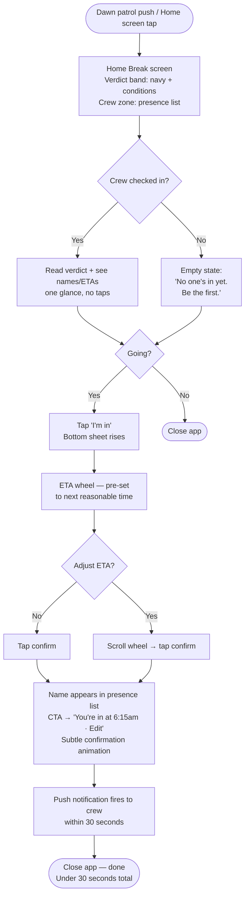
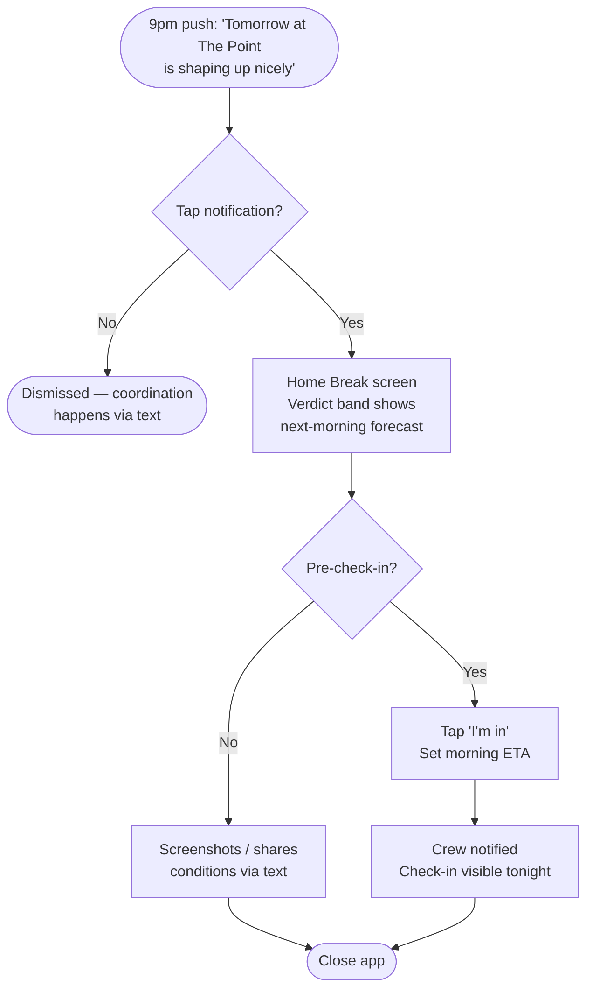
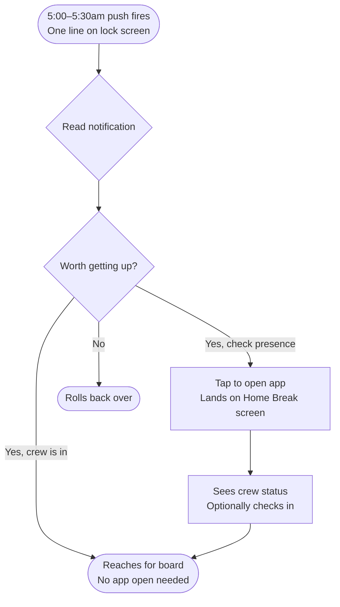
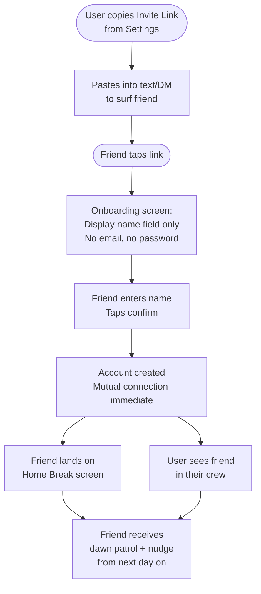

# UX Design Specification Kooks

**Author:** Reef
**Date:** 2026-05-19

---

## Executive Summary

### Project Vision

Kooks is a social-first surf PWA organized around the Break as the atomic interface unit. The product answers a single question before anything else: "Are my people going?" Conditions confirm or veto that answer. The experience succeeds if it resolves the morning surf decision in under 30 seconds — before the user is fully awake. It is not a weather instrument, not a social feed. It is a presence tool.

### Target Users

**Primary:** A recreational surfer with a regular 2–3 person crew. Data-curious but not data-dependent. Makes the go/no-go call on social signal first, conditions second. V1 is designed for one known person — Reef's wife, a morning surfer at Emerald Isle, NC. Her experience is the design ground truth.

**Secondary:** Her crew friends. Low-friction onboarding is load-bearing — the social layer has no value if friends won't join. An invite link tap and a display name is the entire barrier to entry.

### Key Design Challenges

1. **Morning grog state** — Primary use is 5am, phone in bed, half-asleep. Every interaction must require near-zero cognitive effort. Information hierarchy and tap-target design carry extreme weight here.
2. **Social presence without social complexity** — Check-In must feel effortless, but the presence layer must feel alive and real. Too much UI and it becomes a feed; too little and presence feels flat.
3. **Break-centric navigation** — Swiping between Breaks is elegant at 2–3 saved spots. The pattern choice made now must hold as the list grows without redesign.

### Design Opportunities

1. **The Conditions Verdict as a design element** — The 10-word LLM verdict is a personality asset. Typography, scale, and placement can make it feel like a voice — not a readout.
2. **Check-In as a social ritual** — "I'm in" can feel like a satisfying, intentional act rather than a form field. The micro-interaction here can reinforce the product's social energy.
3. **Empty state as signal** — When no friends are checked in yet, that's meaningful: "You'd be the first." Designing this well could encourage more first-movers.

---

## Core User Experience

### Defining Experience

The core loop is the morning Break screen read: open app, land on the Home Break, absorb conditions and friend presence in one glance, optionally check in. Everything else is infrastructure. The Break screen is the product.

The Check-In tap is the most important active interaction — the moment the product delivers social value. Two taps maximum from landing on the Break screen.

### Platform Strategy

PWA, iOS-first, installed to Safari home screen. Touch-only interaction model. No offline mode — graceful stale-state display when data is unavailable. Critical platform constraint: push notifications require home screen installation on iOS 16.4+; this must be communicated in onboarding without friction or alarm.

### Effortless Interactions

- **Reading conditions** — zero taps, always visible, plain language, never a number by default
- **Seeing friend presence** — visible without scrolling, no expansion required
- **Checking in** — one tap to declare intent, one to set ETA, done
- **Auto-expiry** — check-ins vanish without user action; no cleanup required
- **Swipe navigation** — moving between Breaks feels like flipping index cards, not navigating menus

### Critical Success Moments

1. **The 5am open** — She opens the app, reads the conditions verdict, sees a friend is going, taps "I'm in," sets her ETA, closes. Under 30 seconds. This moment must feel frictionless and satisfying or the product has failed its primary purpose.
2. **First crew check-in received** — The first time a friend's name appears on her Break screen via Kooks (not a text), the social layer becomes real. The notification must arrive fast and read clearly on the lock screen.
3. **Successful friend onboarding** — Invite link → display name → appears in crew, under 90 seconds. If this breaks, the social layer never grows.

### Experience Principles

1. **One glance before the first thought** — The Break screen delivers the go/no-go signal before the user's brain is fully awake. Clarity beats completeness.
2. **Social first, data second** — Friend presence ranks above raw data in the hierarchy, always. The product philosophy lives in the layout.
3. **Touch is the interface** — Every critical action reachable in one or two taps from the Break screen. No deep navigation in the morning flow.
4. **Presence, not activity** — The product shows who's going, not who did what. No feed, no history, no social metrics. The only live state that matters is right now, today.

---

## Desired Emotional Response

### Primary Emotional Goals

**Resolved** — the dominant emotion at app-close. She knows she's going, knows her crew is going, knows what she's walking into. The decision is done before she gets out of bed. Not excited, not informed, not entertained — resolved.

**Belonging** — seeing her crew checked in is a small moment of connection. "We're doing this together." This feeling is load-bearing for why anyone uses Kooks over a text thread.

### Emotional Journey Mapping

| Moment | Target Emotion |
|---|---|
| Night-before nudge (9pm) | Anticipation — gentle heads-up from a friend, not an alert |
| Dawn patrol push (5am) | Instant orientation — one line, no friction, no cognitive load |
| Opening the Break screen | Calm confidence — immediately scannable, never overwhelming |
| Tapping "I'm in" | Commitment + social energy — a declaration, not a form submit |
| Seeing a friend's check-in arrive | Delight + validation — the product working as intended |
| Error / stale data / fallback | Neutral, not anxious — calm and honest, not broken |

### Micro-Emotions

| Target | Anti-target |
|---|---|
| Resolved (decision made) | Uncertain (still don't know) |
| Belonging (crew is in) | Isolation (going alone, uncoordinated) |
| Confident (conditions read clearly) | Confused (too much data) |
| Ritualistic (check-in feels intentional) | Transactional (feels like a form) |
| Calm (no noise, no clutter) | Anxious (too much competing for attention) |

### Design Implications

- **Resolved → hierarchy:** Conditions verdict + friend presence above the fold, no scroll, immediately readable. The eye lands on the answer.
- **Belonging → names, not avatars:** First names prominently on the presence layer. A name carries warmth that an icon doesn't.
- **Ritualistic check-in → micro-interaction:** The "I'm in" tap has a satisfying response — a subtle animation that signals *something happened*, not a silent form submit.
- **Calm → whitespace and restraint:** Visual breathing room. The 10-word verdict gets big type. Raw data waits one tap below, doesn't compete.
- **Avoid anxiety → graceful degradation:** Stale data shows a timestamp ("Updated 28 min ago"), not an error state. LLM fallback surfaces raw data cleanly.

### Emotional Design Principles

1. **The decision is the product** — Every design choice is evaluated by whether it helps her feel resolved faster.
2. **Warmth over polish** — Names over icons. Plain language over data. The product should feel like a friend, not an app.
3. **Calm is a feature** — Restraint in visual design is intentional. Whitespace and hierarchy create calm; clutter creates anxiety.
4. **Make the ritual legible** — The Check-In micro-interaction must feel like a small, satisfying act. It's the social heartbeat of the product.

---

## UX Pattern Analysis & Inspiration

### Inspiring Products Analysis

**Instagram** *(primary user's reference)*
The warmth of social presence — familiar names, a sense of what people are up to, the small tactile satisfaction of a social action (like, story tap). Steal: the feeling that the people you care about are right there, and the micro-interaction satisfaction of a social tap. Avoid: the feed model, infinite scroll, algorithmic noise, notification anxiety.

**Tempus** *(builder's reference — music client)*
Opinionated and non-modifiable — the app makes decisions so you don't have to, nails the one thing it does, and resists settings sprawl. No customization rabbit holes. Restraint as product confidence. Maps directly onto Kooks: strong point of view, choices made on the user's behalf, no escape hatches.

**Tailscale** *(builder's reference — status board)*
The sharpest structural reference for Kooks. Open the app, immediately see which machines are connected — no navigation, no action needed. The home screen is the answer. Named entities with a live status indicator. Directly analogous to the Break screen: open, see conditions + who's going, done.

**Telegram** *(anti-inspiration)*
Used because people are there, not because it's well-designed. Too many features, coordination buried under product surface area. Warning: don't build the Band app. Every feature beyond the core loop is a Telegram risk.

### Transferable UX Patterns

**Navigation:**
- Tailscale's no-nav status board → the Break screen is the whole app; no navigation required to get the answer
- Instagram's swipe-first mental model → horizontal swipe between Breaks feels native to a user who already swipes Stories

**Interaction:**
- Instagram's micro-interaction warmth → the Check-In tap needs a clear, satisfying state change — not a silent submit
- Tempus's opinionated defaults → never ask the user to configure what the app can decide; ETA picker defaults to next reasonable time, Home Break prompted once and remembered

**Visual / Information:**
- Tailscale's named-entity-with-status → each crew member on the presence layer is a name + ETA, nothing more needed
- Tempus's restraint → the Conditions Verdict gets the visual hierarchy; everything else steps back

### Anti-Patterns to Avoid

- **Surfline's data-first hierarchy** — numbers before meaning; requires expertise to parse at 5am
- **Telegram's feature sprawl** — adding coordination tools beyond the core presence loop
- **Instagram's feed model** — chronological or algorithmic activity streams; Kooks has no feed
- **Social apps' per-action pickers** — "who do you want to share this with?" — Kooks uses mutual opt-in; the whole crew sees everything, always
- **Settings-heavy customization** — if the user has to configure it, the app failed to decide for them

### Design Inspiration Strategy

| Adopt | From | Because |
|---|---|---|
| No-nav status board as home screen | Tailscale | The answer is visible without a single tap |
| Named entities with live status | Tailscale | Names + ETA is all the presence layer needs |
| Opinionated, non-modifiable experience | Tempus | Product confidence; don't offer choices the app can make |
| Social micro-interaction warmth | Instagram | Check-In tap must feel like a satisfying social act |

| Adapt | From | How |
|---|---|---|
| Instagram's swipe familiarity | Instagram | Horizontal swipe for Breaks, not Stories — same gesture, different atomic unit |
| Tailscale's status indicator | Tailscale | Status is presence + ETA (richer than connected/not), displayed as name + time |

| Avoid | Why |
|---|---|
| Feed / activity stream model | No chronology, no history — only live state today |
| Feature sprawl | Kooks does one thing; every addition is a Telegram risk |
| Data-first hierarchy | Raw data lives one tap below the verdict, never above |
| Per-action sharing controls | Crew sees everything; no picker, no friction |

---

## Design System Foundation

### Design System Choice

**Tailwind CSS + shadcn/ui**

### Rationale for Selection

- **Tailwind CSS** enforces compositional restraint — utility-first means no framework aesthetic competing with the product's visual voice. The whitespace-heavy, hierarchy-driven design Kooks requires is easiest to achieve when building from primitives.
- **shadcn/ui** provides accessible, unstyled component primitives (drawer, sheet, dialog, etc.) copied directly into the project — fully owned, fully themeable, no dependency lock-in.
- **iOS-native feel** — no Material or Bootstrap aesthetic to fight; the neutral base sits naturally within Safari/PWA context.
- **Solo builder fit** — both are fast to prototype, exceptionally documented, and widely supported.

### Implementation Approach

Components are installed directly into the codebase via shadcn/ui CLI and themed from day one. No external design system dependency at runtime — what ships is your code.

Core components needed for V1:
- Break screen layout (full-viewport, swipeable)
- Conditions Verdict display (hero text)
- Presence list (name + ETA rows)
- Check-In sheet/drawer (bottom sheet, ETA picker)
- Raw data expand panel (tap-to-reveal)
- Notification permission prompt (inline, non-alarming)

### Customization Strategy

Define a small, coastal-adjacent design token set:

- **Color palette:** Deep water (primary), early morning light (background), sand/warm neutral (secondary), green (checked-in status), muted (no presence / stale)
- **Typography:** One typeface, two weights. Verdict gets large display size. Data gets small, muted. Names get medium weight for warmth.
- **Spacing:** Generous. The Verdict needs breathing room. Presence list rows need comfortable tap targets (minimum 48px).
- **Motion:** Subtle only — Check-In state change, swipe transition. No decorative animation.

---

## Defining Core Experience

### Defining Experience

> "Open the app, see who's going and whether it's worth it, and check in — all before your brain is fully awake."

The magic is the combination of conditions and social presence in one glance, before any effort is required. Not conditions checking. Not friend coordination. Both, together, immediately.

### User Mental Model

Current mental model: two-app sequence (surf app → parse data, text thread → wait for responses). The go/no-go decision happens after both, unconfirmed, in her head.

Kooks collapses both into a single surface. The mental model shift is small — she already understands a Break screen and what "Sarah's in" means. What's new is that both are together, immediately readable. Learning curve is near-zero.

Key confusion risk: first open with no crew checked in. Empty state must communicate presence, not brokenness.

### Success Criteria

- Answer visible in ≤ 10 seconds without tapping anything
- Check-in completed in ≤ 2 taps from the Break screen
- ETA picker defaults to next sensible time — no thinking required
- After check-in, her name is immediately visible in the presence list
- Entire morning flow achievable one-handed, in bed, without glasses

### Novel UX Patterns

The core interaction uses **established patterns combined in a novel way** — no user education required:

| Pattern | Familiar from |
|---|---|
| Swipe between cards | Instagram Stories |
| Tap to check in | RSVP flows, event apps |
| ETA time picker | Calendar, OpenTable |
| Auto-refreshing live data | Weather apps, sports scores |

The novelty is the combination and hierarchy — conditions and social presence on the same card. The layout teaches itself.

### Experience Mechanics

**1. Initiation**
Home screen tap or dawn patrol push notification tap → lands directly on Home Break screen. No splash, no loading brand screen, no navigation required.

**2. Interaction**
- Reads Conditions Verdict (hero, top, immediate)
- Scans presence list (names + ETAs, below verdict)
- Taps Check-In CTA → bottom sheet rises
- ETA wheel pre-set to next reasonable time
- Adjusts if needed → taps confirm

**3. Feedback**
- Her name appears in the presence list immediately
- Check-In CTA changes state: "You're in at 6:15am" + edit affordance
- Subtle animation confirms the action
- Crew receives push notification within 30 seconds

**4. Completion**
App closed. No required next step. Decision made, crew notified, done. Under 30 seconds total.

---

## Visual Design Foundation

### Color System

| Token | Value | Usage |
|---|---|---|
| `--bg` | `#f5f0e8` | App background, screen fill |
| `--text-primary` | `#1a1a1a` | Verdict, crew names, primary content |
| `--text-secondary` | `#8a7e6e` | Break name, ETAs, labels, timestamps |
| `--action` | `#1a3a5c` | CTA button, active swipe dot, links |
| `--action-fg` | `#f5f0e8` | Text on action-colored surfaces |
| `--present` | `#2e8b57` | Checked-in status dot |
| `--divider` | `rgba(26,58,92,0.10)` | Section dividers |
| `--surface` | `#ede8df` | Bottom sheet, expanded panels |
| `--stale` | `#c2b9ac` | Stale data indicator, disabled states |

### Typography System

Single typeface: **Inter**, two weights: 400 and 700.

| Role | Size | Weight | Treatment |
|---|---|---|---|
| Conditions Verdict | 28px | 700 | Tight leading (1.18), −0.02em tracking |
| Break name | 11px | 400 | Uppercase, +0.14em tracking, secondary color |
| Crew name | 16px | 700 | Normal leading |
| ETA / supporting | 13px | 400 | Secondary color |
| Labels (Crew, Raw Data) | 10px | 400 | Uppercase, +0.14em tracking, secondary color |
| Timestamp | 10px | 400 | Uppercase, centered, very muted |

### Spacing & Layout Foundation

Base unit: 8px. All spacing is a multiple of 8.

- Screen side padding: 28px
- Status bar clearance: 56px top
- Bottom safe area: 36px
- Crew list row height: 48px minimum (tap target)
- CTA button padding: 18px vertical, 16px border radius
- Verdict bottom margin: 10px; raw data toggle bottom margin: 36px

Single-column, full-viewport layout. Vertical stack: break name → verdict → raw data toggle → divider → crew list → CTA → timestamp.

### Accessibility Considerations

- All text/background pairs exceed WCAG AA; primary pairs exceed AAA
- Minimum tap target 48px on all interactive elements
- Status dot supplemented with text label for screen reader support
- No information conveyed by color alone — name + ETA always accompany status dot
- Critical content (verdict, names) at 16px minimum; supplementary labels at 10px

---

## Design Direction Decision

### Design Directions Explored

Six directions were generated and evaluated using the Morning Light palette:

| # | Name | Concept |
|---|---|---|
| D1 | Canonical — Verdict First | Verdict hero top, crew below, full-width CTA. The baseline layout. |
| D2 | Crew Forward | Crew presence first, verdict below. Tests social-first hierarchy. |
| D3 | Verdict Band | Navy header panel for verdict (white text), warm parchment for crew section. |
| D4 | Minimal | No labels or dividers, maximum whitespace. Most restrained approach. |
| D5 | Checked-in State | D1 showing post-check-in state — name in presence list, CTA becomes "You're in · Edit". |
| D6 | Empty State | D1 with no crew yet — "No one's checked in yet. Be the first to go." |

### Chosen Direction

**D3 — Verdict Band (Navy Header)**

The Break screen is split into two distinct zones:

1. **Verdict zone (top):** Full-width navy (`--action: #1a3a5c`) header panel. Break name, swipe dots, Conditions Verdict (white text, large, bold), and raw data toggle. The conditions read gets its own visual stage.
2. **Crew zone (bottom):** Warm parchment (`--bg: #f5f0e8`) background. Crew label, presence list (names + ETAs), Check-In CTA, timestamp.

### Design Rationale

- The two-zone split makes the product's philosophy legible in the layout itself: conditions and social presence each occupy their own domain, visually distinct but spatially unified
- The navy verdict band gives the LLM-generated text the weight it deserves — the voice of the product has its own stage
- The warm parchment crew zone reinforces the social warmth principle — names on a friendly, light background feel personal, not clinical
- The visual break between zones creates natural scanning rhythm: read the verdict (top), look for your people (bottom), tap in

### Implementation Notes

- The navy header extends behind the iOS status bar (safe area handled via `padding-top`)
- Swipe dots sit in the header band — they appear on the navy background in `--action-fg` color
- The raw data toggle and webcam link also live in the header band (they are conditions-layer elements)
- The bottom sheet (Check-In drawer) rises over the crew zone on `--surface` background
- D5 and D6 state variations apply to the crew zone only; the verdict band is unchanged across states

---

## User Journey Flows

### UJ-1 — Morning Decision (Primary Critical Path)

### UJ-2 — Night-Before Planning

### UJ-3 — Dawn Patrol Push (No-Open Path)

### UJ-4 — Friend Onboarding

### Journey Patterns

**Navigation:**
- Every journey entry lands directly on the Break screen — no hub, no nav menu, no splash
- Back navigation is never required in the primary flow; the Break screen is always home

**Decision:**
- All critical decisions are binary (going / not going, adjust ETA / don't) — no multi-step forms
- Bottom sheet for the single multi-input moment (Check-In ETA) — rises from crew zone, never navigates away

**Feedback:**
- State change is always visible immediately in the same view (name appears in list, CTA changes)
- Crew notification fires silently in the background — no confirmation modal needed

### Flow Optimization Principles

- **Zero-tap answer:** UJ-1 delivers the go/no-go signal before any interaction is required
- **Pre-set defaults:** ETA picker defaults to next sensible time — reduces decision load at the most critical moment
- **Empty state as invitation:** No-crew state is warm and active ("Be the first") — not an error or dead end
- **Graceful fallback:** Stale data shows age via timestamp; LLM fallback shows raw data in the same verdict band layout — no broken states

---

## Component Strategy

### Design System Components (shadcn/ui + Tailwind)

| Component | Source | Usage |
|---|---|---|
| Drawer | shadcn/ui | Check-In bottom sheet |
| Dialog | shadcn/ui | Onboarding name entry |
| Button | shadcn/ui (themed) | CTA, confirm actions |
| Switch | shadcn/ui | Notification preferences |
| Separator | shadcn/ui | Verdict band / crew zone boundary |
| Toast | shadcn/ui | In-app feedback |

### Custom Components

#### BreakScreen
**Purpose:** Primary full-viewport surface. Hosts `VerdictBand` (top) and `CrewZone` (bottom). The atomic unit of the entire app.
**States:** Default · Empty crew · Stale data · LLM fallback · Checked-in
**Interaction:** Horizontal swipe left/right navigates between Break screens. No internal scrolling.

#### VerdictBand
**Purpose:** Navy top zone displaying break name, swipe dots, conditions verdict, raw data toggle, and webcam link.
**Anatomy:** Break label (11px uppercase) → swipe dots → verdict text (28px bold, white) → raw data toggle → webcam link (when configured)
**States:** Live verdict · LLM fallback (raw data values inline) · Loading (skeleton)
**Accessibility:** `aria-live="polite"` on verdict text; `aria-expanded` on raw data toggle.

#### CrewZone
**Purpose:** Warm parchment bottom zone showing crew presence list and check-in CTA.
**Anatomy:** "Crew" label → presence list → CTA button → timestamp
**States:** Crew present · Empty (no check-ins) · User checked in

#### CrewMemberRow
**Purpose:** Single presence entry — one checked-in crew member.
**Anatomy:** Status dot (green, 8px) + name (16px bold) + ETA (13px secondary). Min height 48px.
**States:** Present · Self (name in `--present` color)
**Accessibility:** `aria-label="[Name] is going at [ETA]"` on each row.

#### CheckInCTA
**Purpose:** Primary action button. Changes state after check-in.
**States:**
- Default: Full-width navy button, "I'm in"
- Checked in: Surface background, green border, "✓ You're in at [time] · Edit"
**Interaction:** Tap → opens `CheckInDrawer`. Confirm → transitions to checked-in state with subtle scale animation.

#### CheckInDrawer
**Purpose:** Bottom sheet for check-in or edit. The only multi-input moment in the primary flow.
**Anatomy:** Drag handle → "[Break name]" header → `ETAPicker` → Confirm button → Remove link (edit mode only)
**States:** New check-in · Edit existing
**Accessibility:** Focus trapped inside drawer when open. Swipe-down or ESC closes.

#### ETAPicker
**Purpose:** Custom time selection wheel within `CheckInDrawer`. 15-minute intervals, 5:00am–10:00am range.
**Interaction:** Scroll/swipe with momentum. Snap to nearest 15-min slot. Pre-set to next sensible time on open.

#### EmptyCrewState
**Purpose:** CrewZone state when no crew is checked in. Signals opportunity, not failure.
**Content:** "No one's checked in yet." (15px bold, secondary) + "Be the first to go." (13px, muted)

### Component Implementation Strategy

All custom components are built using Tailwind utility classes and the established design tokens. shadcn/ui primitives (Drawer, Dialog, Button) are installed via CLI and themed from day one — no runtime design system dependency.

### Implementation Roadmap

**Phase 1 — Core (blocking UJ-1):**
- `BreakScreen`, `VerdictBand`, `CrewZone`
- `CrewMemberRow`
- `CheckInCTA` (both states)
- `CheckInDrawer` + `ETAPicker`
- `EmptyCrewState`

**Phase 2 — Supporting (complete V1):**
- Raw data expand panel (within `VerdictBand`)
- Webcam link row (within `VerdictBand`)
- Swipe navigation between Break screens
- Notification permission prompt (inline, onboarding)

**Phase 3 — Settings & Management:**
- Break list management UI
- Crew management UI
- Notification preference toggles
- Invite link copy/share

---

## UX Consistency Patterns

### Button Hierarchy

One primary action per screen, always. Never two navy buttons competing.

| Tier | Usage | Style |
|---|---|---|
| Primary | "I'm in" — the one critical action | Full-width navy, white text, 18px padding |
| Confirmed | "✓ You're in at [time] · Edit" | Surface bg, green border, green text |
| Destructive-secondary | "Remove check-in" (drawer only) | `--text-secondary` color, no background |

### Feedback Patterns

No blocking modals for feedback. State changes happen in the view.

| Situation | Pattern |
|---|---|
| Check-in confirmed | Inline state change (CTA + name in list) + subtle scale animation |
| Friend checked in | System push notification — not in-app |
| Stale data | Timestamp in `--stale` color ("Updated 28 min ago") |
| LLM fallback | Raw data values replace verdict text, same band layout |
| Network error | Timestamp goes stale + "Unable to update" — one line, no blocking modal |
| Check-in removed | Name disappears from list, CTA reverts — immediate, no confirmation dialog |

### Form Patterns

Two input moments only:

1. **Display name (onboarding):** Single text field, autofocus, large tap target. "Continue" activates only when non-empty. No validation on first render.
2. **ETA picker (Check-In drawer):** Custom scroll wheel — no keyboard. Always has a pre-set value; no required-field validation needed.

Rule: validation only fires after a submit attempt, never on first render.

### Navigation Patterns

| Pattern | Behavior |
|---|---|
| Between Breaks | Horizontal swipe — no tab bar, no back button |
| To Settings | Persistent icon (top-right of crew zone) — one tap |
| Within Settings | Vertical list, native back gesture |
| Check-In drawer | Rises from bottom on tap; dismiss via swipe-down or drag handle |
| Notification tap | Deep-links directly to relevant Break screen |

Rule: the Break screen is always home. No app-level back stack in the primary flow.

### Empty States

Every empty state contains an action. Never a dead end.

| Screen | Content |
|---|---|
| No crew check-ins | "No one's checked in yet. Be the first to go." |
| No breaks saved | "Add your first break" + map pin CTA |
| No crew connected | "Invite your first crew member" + invite link CTA |

### Loading States

Skeleton over spinner everywhere — skeletons set layout expectations, spinners imply unknown duration.

| Element | Treatment |
|---|---|
| Conditions verdict | Skeleton text (2 lines, navy band, muted opacity) |
| Crew list | Skeleton rows (2 rows, parchment background) |
| App first load | Skeleton entire Break screen — no spinner, no splash |

---

## Responsive Design & Accessibility

### Responsive Strategy

Kooks is mobile-only by design. No desktop or tablet layout in V1.

| Platform | Strategy |
|---|---|
| iOS (primary) | Full-viewport, touch-first, installed to home screen. All design decisions made here. |
| Android | Works incidentally — layout holds, not optimized. Not a V1 target. |
| Tablet / Desktop | Not targeted. App renders centered at max-width 430px on larger screens. |

### Breakpoint Strategy

Single breakpoint philosophy: design for one width, let it work elsewhere.

| Width | Treatment |
|---|---|
| 375px (iPhone SE) | Primary design floor — all layouts verified here |
| 390px (iPhone 14/15) | Natural primary device |
| 430px (iPhone 14/15 Plus) | Layout holds without changes |
| 768px+ | App centered at `max-w-[430px] mx-auto`, `--bg` fills remainder |

### Accessibility Strategy

Target: **WCAG 2.1 AA**.

| Area | Requirement |
|---|---|
| Color contrast | All pairs exceed AA (verified in Visual Foundation) |
| Touch targets | 48px minimum on all interactive elements |
| Screen reader | `aria-live="polite"` on verdict; `aria-label` on crew rows; `aria-expanded` on raw data toggle |
| Focus management | Focus trapped in `CheckInDrawer` when open; returns to CTA on close |
| Motion | `prefers-reduced-motion` respected — disable check-in animation and swipe transitions |
| Text sizing | `rem` units throughout — respects iOS dynamic type |
| Status dot | Always paired with name + ETA text — never color-only |

### Testing Strategy

| Test type | Approach |
|---|---|
| Device | Primary user's actual iPhone + iPhone SE (smallest supported) |
| Safari PWA | Installed to home screen — full push notification flow on device, not simulator |
| VoiceOver | Critical path: open app → read verdict → check in. Full walkthrough before launch. |
| Reduced motion | iOS Settings → Accessibility → Motion → Reduce Motion. Verify no animations fire. |
| Contrast | DevTools accessibility panel + manual check on any new color combinations |

### Implementation Guidelines

- `rem` for all font sizes (base 16px) — respects iOS dynamic type scaling
- `min-h-[48px]` on all tappable rows — never `h-` which clips content
- Safe area insets via `@tailwindcss/safe-area` plugin (`pb-safe`, `pt-safe`) — handles notch and home indicator
- `aria-live="polite"` on `VerdictBand` content container — announces verdict updates without interrupting
- `prefers-reduced-motion` media query wrapping all CSS transitions — one global rule in base styles
- App root: `max-w-[430px] mx-auto min-h-screen bg-bg`
- Morning Light tokens are registered in the `@theme inline` block of `globals.css` and used as plain Tailwind utilities — `bg-bg`, `bg-surface`, `bg-action`, `text-action-fg`, `text-text-primary`, `text-text-secondary`, `text-present`, `text-stale`, `border-divider`. Never `bg-[--bg]`: Tailwind v4 dropped the bare-variable shorthand and it compiles to CSS the browser discards silently. *(Corrected 2026-08-31.)*
